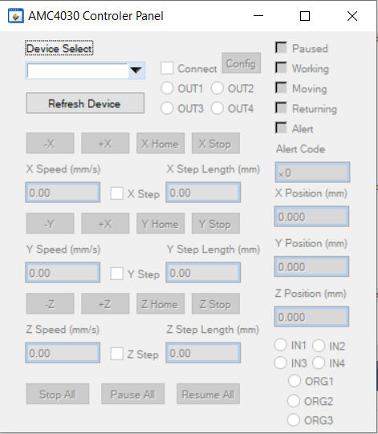

# AMC4030-usbserial-controller
Reverse engineered AMC4030 motion controller usbserial protocol. Along with a labwindows/cvi implemented ui frontend.

## Rationale
The sdk from manufacturer's `AMC4030.dll`'s design have several fatal flaws:

1. Every call to COM_API_SetComType creates a MFC thread that never terminates.
2. Multiple calls of COM_API_SetComType causes internal race condition
3. Requires `mfc110u.dll` to run.
4. The first ch340 usbserial device enumerated was used, can be erronous if using ch340 converters for other device, 
and cannot support multiple device instances.
5. Binary distribution, not easily portable to new platforms.

## Features
Protocol, status monitor and ui frontend separable. Device enumerator included. UI usable as subpanel and runnable as standalone.

More features and fixes may be included later.

## Build
Compiles with msvc's compiler both in legacy mode and in c11 mode, cvi's ansi c compiler and with c99 extensions.

Libraries compilable as both static and dynamic. Dynamic library by default (in vs) build with builtin runtime (`/MT` option) 
and does not bloat (only functions like `malloc` `free` in `stdlib`, `snprintf` in `stdio` used).

Currently only windows backend implemented for functions that enumerates device or does serial port IO. Help with other backends 
welcome.

UI frontend requires Labwindows/CVI 2017+ cvirte to compile or run. Other frontend is also easy.

